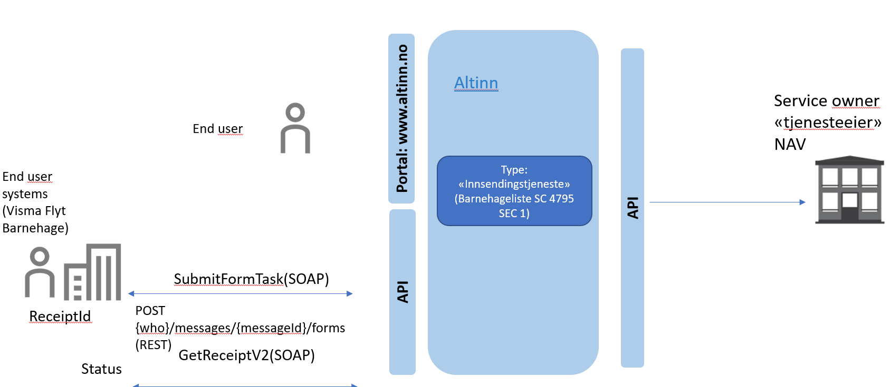
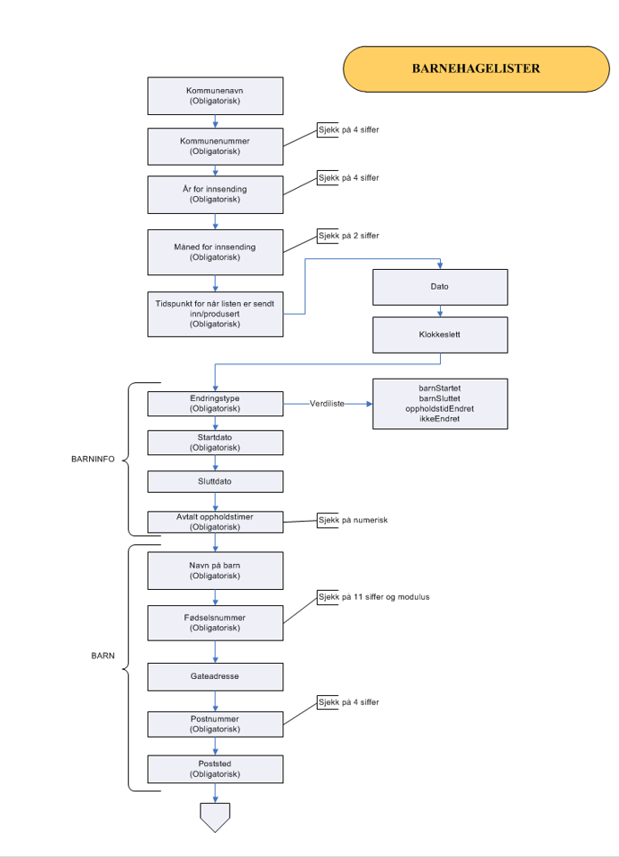

## Bakgrunn

NAV bruker barnehagelister for avslutning av kontantstøtte når barn starter i barnehagen. I dag sender kommunene barnehagelistene på papir eller PDF. NAV ønsker at alle leverandører av barnehagesystemer skal ta i bruk Altinn-tjenesten _Barnehagelister - innsending av barnehagelister som brukes til kontroll av kontantstøtteutbetalinger_. På sikt vil det trolig bli _digitalt enevalg_ for rapportering på en rekke områder, analogt til hvordan inntektsmeldinger fra 1.1.2019 kun kan rapporteres elektronisk.

## Kort om integrasjon med Altinn


Altinn tilbyr APIet for innsending av _Barnehagelister_. Systemleverandørene som tar i bruk denne tjenesten må integrere med Altinn. 
- Systemleverandøren kan velge å benytte WS eller REST mot Altinn
- Systemleverandører henvender seg til Altinn for hjelp via adressen sluttbrukersystem@altinn.no

For informasjon om hvordan man kommer i gang, samt teknisk dokumentasjon:
- https://altinn.github.io/docs/api/datasystem/
- https://tt02.altinn.no/api/help

Det er NAV som har utviklet _Barnehagelister_-tjenesten i Altinn
- Service code: `4795` 
- Service Edition Code: `1`
- For å komme i kontakt med NAV kan adressen nav.altinn.lokalforvaltning@nav.no benyttes.

## Skjema i Altinn
Skjemaet i Altinn er skissert nedenfor:


## Skjemaflyt



## Welcome to GitHub Pages

You can use the [editor on GitHub](https://github.com/navikt/barnehagelister/edit/master/README.md) to maintain and preview the content for your website in Markdown files.

Whenever you commit to this repository, GitHub Pages will run [Jekyll](https://jekyllrb.com/) to rebuild the pages in your site, from the content in your Markdown files.

### Markdown

Markdown is a lightweight and easy-to-use syntax for styling your writing. It includes conventions for

```markdown
Syntax highlighted code block

# Header 1
## Header 2
### Header 3

- Bulleted
- List

1. Numbered
2. List

**Bold** and _Italic_ and `Code` text

[Link](url) and 
```

For more details see [GitHub Flavored Markdown](https://guides.github.com/features/mastering-markdown/).

### Jekyll Themes

Your Pages site will use the layout and styles from the Jekyll theme you have selected in your [repository settings](https://github.com/navikt/barnehagelister/settings). The name of this theme is saved in the Jekyll `_config.yml` configuration file.

### Support or Contact

Having trouble with Pages? Check out our [documentation](https://help.github.com/categories/github-pages-basics/) or [contact support](https://github.com/contact) and we’ll help you sort it out.
