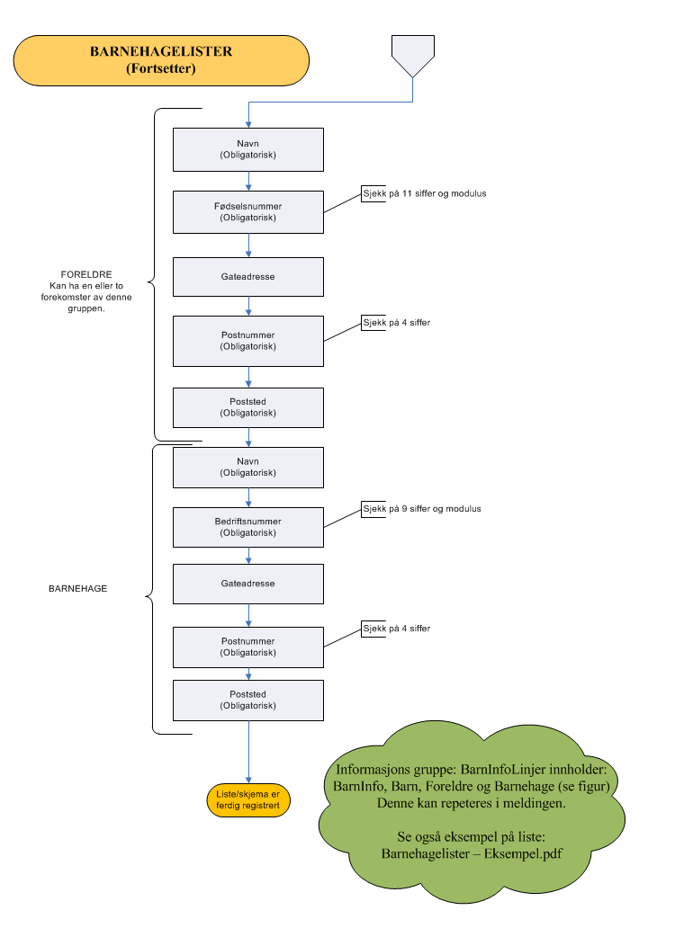
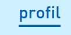
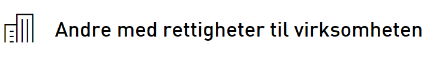
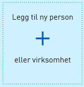
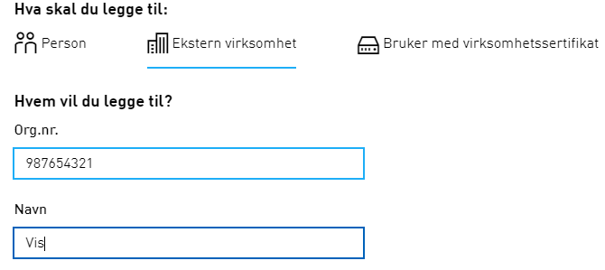
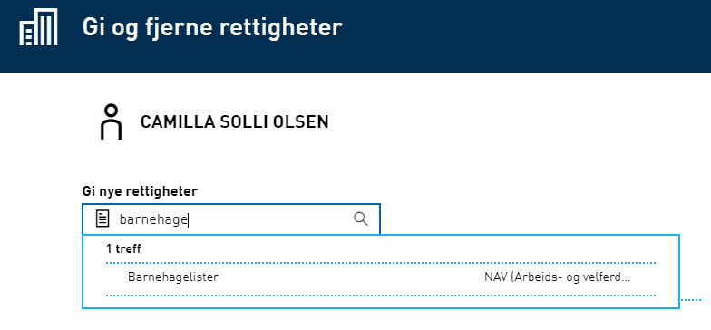
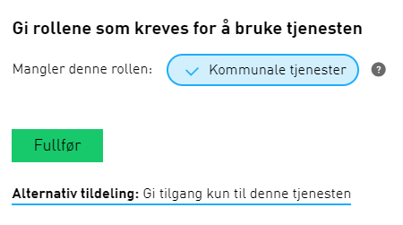

## Bakgrunn

NAV bruker barnehagelister for avslutning av kontantstøtte når barn starter i barnehagen. I dag sender kommunene barnehagelistene på papir eller PDF. NAV ønsker at alle leverandører av barnehagesystemer skal ta i bruk Altinn-tjenesten _Barnehagelister - innsending av barnehagelister som brukes til kontroll av kontantstøtteutbetalinger_. På sikt vil det trolig bli _digitalt enevalg_ for rapportering på en rekke områder, analogt til hvordan inntektsmeldinger fra 1.1.2019 kun kan rapporteres elektronisk.

## Kort om integrasjon med Altinn

Altinn tilbyr APIet for innsending av _Barnehagelister_. Systemleverandørene som tar i bruk denne tjenesten må integrere med Altinn. 
- Systemleverandøren kan velge å benytte WS eller REST mot Altinn
- Systemleverandører henvender seg til Altinn for hjelp via adressen sluttbrukersystem@altinn.no

For informasjon om hvordan man kommer i gang, samt teknisk dokumentasjon:
- https://altinn.github.io/docs/api/datasystem/
- https://tt02.altinn.no/api/help

Det er NAV som har utviklet _Barnehagelister_-tjenesten i Altinn
- Service code: `4795` 
- Service Edition Code: `1`
- For å komme i kontakt med NAV kan adressen nav.altinn.lokalforvaltning@nav.no benyttes.

## Skjema i Altinn
Skjemaet i Altinn er skissert nedenfor:

## Skjemaflyt

## Tildeling av rettigheter i Altinn for Barnehagelister

| Handling                          | Illustrasjon |
|-----------------------------------|--------------|
| **Altinn.no:** Person i kommunen med rollen _tilgangsstyring*_ og rettighet til barnehageliste eller rollen _Kommunale tjenester_ må logge inn i Altinn og velge hovedenheten på den virksomheten _Leverandøren_ skal få rettigheter til. |  |
| Velg _Profil_ på menylinjen |  |
| Velg deretter _Andre med rettigheter til virksomheten_ | 
| Velg _Legg til ny person eller virksomhet_. |  |
| Legg inn organisasjonsnummeret til _Leverandøren_ og minimum de 4 første bokstavene i navnet.|  |
| Søk opp enkelttjenestene ved å skrive `Barnehagelister` i søkefeltet. Det er denne som skal tildeles. |  |
| Når du trykker på tjenesten `Barnehagelister` kommer du til et nytt vindu der du kan velge om du vil gi rollen `Kommunale tjenester` som gir rettighet til flere tjenester eller å kun gi tilgang til tjenesten _Barnehagelister_. |  |

_Leverandøren_ har nå rettighet å representere kommunen med underenheter på kommunale tjenester eller tjenesten _Barnehagelister_.

**Merk**. Daglig Leder og styreleder hos Leverandøren får implisitt samme rettigheter som Leverandøren.

**NB!** For kommuner med virksomhetsledd må dette gjennomføres for samtlige relevante virksomhetsledd.
 * _«Person med rollen tilgangsstyring» er i en kommune ordfører og rådmann. Disse to kan da ha delegert dette videre til flere personer i kommunen. Ansvarlige personer knyttet til organisasjonsnummeret kan søkes opp på www.brreg.no . Kommuner med spørsmål relatert til dette må kontakte Altinn brukerstøtte for hjelp._
